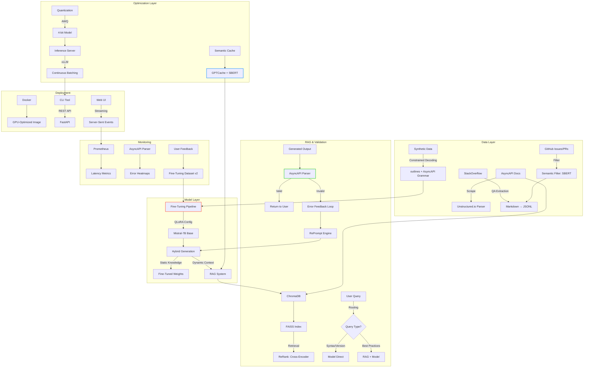

```mermaid
graph TD
    subgraph Data Layer
        A[AsyncAPI Docs] -->|Scrape| B[Unstructured.io Parser]
        C[GitHub Issues/PRs] -->|Filter| D[Semantic Filter: SBERT]
        E[StackOverflow] -->|QA Extraction| F[Markdown → JSONL]
        G[Synthetic Data] -->|Constrained Decoding| H[outlines + AsyncAPI Grammar]
    end

    subgraph Model Layer
        I[Fine-Tuning Pipeline] -->|QLoRA Config| J[Mistral-7B Base]
        J --> K[Hybrid Generation]
        K -->|Static Knowledge| L[Fine-Tuned Weights]
        K -->|Dynamic Context| M[RAG System]
    end

    subgraph RAG & Validation
        M --> N[ChromaDB]
        N --> O[FAISS Index]
        O -->|Retrieval| P[ReRank: Cross-Encoder]
        Q[User Query] -->|Routing| R{Query Type?}
        R -->|Syntax/Version| S[Model Direct]
        R -->|Best Practices| T[RAG + Model]
        U[Generated Output] --> V[AsyncAPI Parser]
        V -->|Valid| W[Return to User]
        V -->|Invalid| X[Error Feedback Loop]
        X --> Y[RePrompt Engine]
    end

    subgraph Optimization Layer
        Z[Semantic Cache] --> AA[GPTCache + SBERT]
        AB[Quantization] -->|AWQ| AC[4-bit Model]
        AD[Inference Server] -->|vLLM| AE[Continuous Batching]
    end

    subgraph Deployment
        AF[Docker] --> AG[GPU-Optimized Image]
        AH[CLI Tool] -->|REST API| AI[FastAPI]
        AJ[Web UI] -->|Streaming| AK[Server-Sent Events]
    end

    subgraph Monitoring
        AL[Prometheus] --> AM[Latency Metrics]
        AN[AsyncAPI Parser] --> AO[Error Heatmaps]
        AP[User Feedback] --> AQ[Fine-Tuning Dataset v2]
    end

    A --> N
    D --> F
    H --> I
    Y --> K
    AA --> M
    AC --> AD
    AE --> AH
    AK --> AL
    AQ --> I

    style I stroke:#ff6347,stroke-width:2px
    style V stroke:#32cd32,stroke-width:2px
    style AA stroke:#1e90ff,stroke-width:2px
```